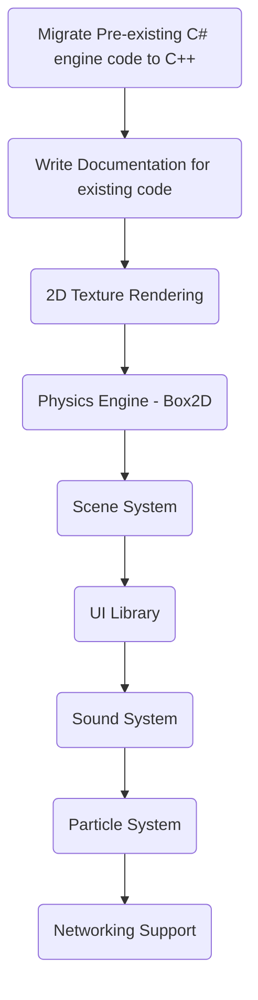

# StirlingEngine

## Purpose
This is a 2 Dimentional Game Engine programmed in C++ using the Simple and Fast Multimedia Platform ([SFML](https://www.sfml-dev.org/)).

## Roadmap

## Getting Started

### [Getting Started Guide](docs/GettingStarted.md)
A quick tutorial to get you started with the engine.

### [Documentation](docs/)
Full documentation for the engine and API

### [Compiling Documentation](docs/COMPILING.md)
A step-by-step documentation on compiling the Stirling Engine

## Contributing
The Stirling Engine project would love your contribution, please read the [CONTRIBUTING.md](docs/CONTRIBUTING.md)