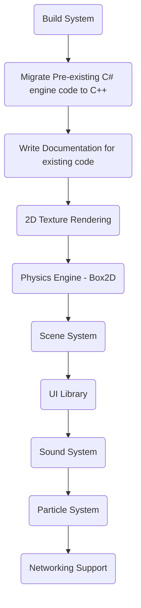

# StirlingEngine

## Purpose
This is a 2 Dimentional Game Engine programmed in C++ using the Simple and Fast Multimedia Platform ([SFML](https://www.sfml-dev.org/)).

## Roadmap

## Getting Started
### [Compiling Documentation](docs/COMPILING.md)
A step-by-step documentation on compiling the Stirling Engine
<!-- ### [Starting a New Project](docs/NEW_PROJ.md)
A guide on how to start a new project using the Stirling Engine -->

## Contributing
The Stirling Engine project would love your contribution, please read the [CONTRIBUTING.md](docs/CONTRIBUTING.md)